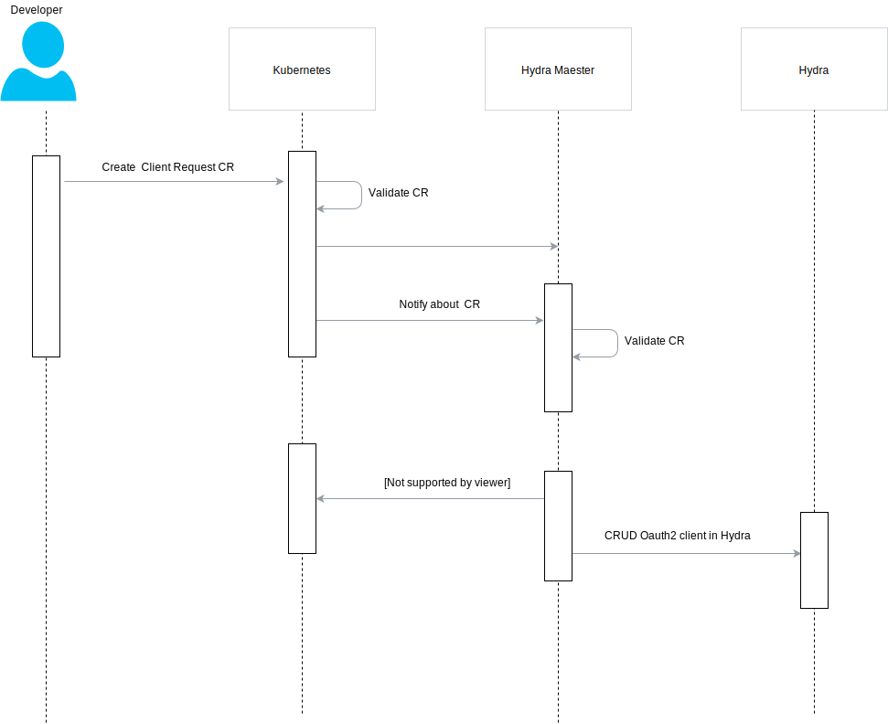
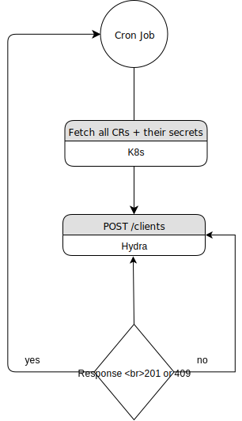

# Design

## Controller design

The controller listens for Custom Resource which defines client registration request. Once Custom resource is created, the controller register oauth2 client in hydra using hydra's REST API.
Client Id, Client Secret and Identifier of the client in hydra are be stored in the kubernetes as a secret and referenced in the applied CR.
Reference is used to identify in which kubernetes secret are stored mentioned properties. Secret iscreated in the same namespace of applied CR.
By default controller should be deployed in the same pod as hydra. Service discovery will come in place in the future.

Custom Resource should be Namespace scoped.
It is represented in the diagram 

## Synchronization mode

Additionally, controller supports synchronization mode, where it tries to register all clients in hydra.
Synchronization is an optional mode, enabled via config, which is meant for use cases where hydra is deployed with in memory storage.
If hydra pod is restarted for some reason then it does not have client in its storage. With synchronization mode the controller makes sure that hydra has up to date clients.
Synchronization is done by making POST request to hydra with payload describing all client information including clientID,clientSecret and Identifier of last applied client.
If client exists in hydra storage 409 is returned which is considered as ok and synchronization continues with other clients.

